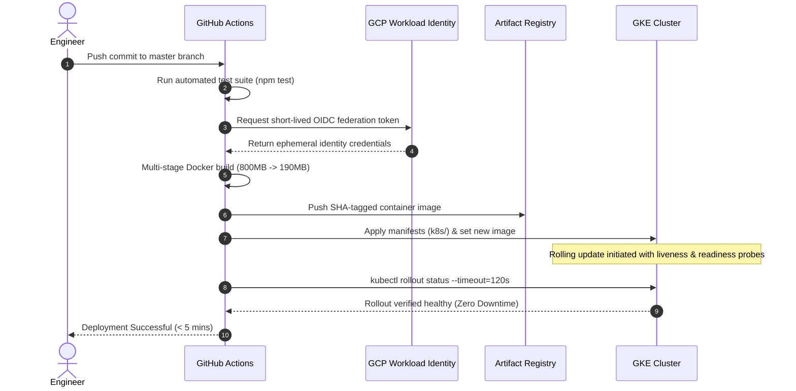

# Production NestJS Platform on GCP

[](https://github.com/kuhaad-dev/nestjs-platform/actions)


A production-grade, enterprise backend platform engineered with **NestJS**, fully provisioned on **Google Cloud Platform (GCP)** using **Terraform (IaC)**, orchestrated on **Google Kubernetes Engine (GKE)**, and automated via a **keyless GitHub Actions CI/CD pipeline with Workload Identity Federation**. Includes full **Prometheus/Grafana RED method observability**, **Horizontal Pod Autoscaling (HPA)**, and **multi-stage Docker container optimization**.

---

## Architectural Highlights

- **Infrastructure as Code (Terraform)**: Declarative, version-controlled provisioning of custom GCP VPC networks, subnets, GKE control planes, and decoupled node pools with resource limits.
- **Keyless Zero-Trust CI/CD**: Automated deployment to GKE in under 5 minutes using **GCP Workload Identity Federation (OIDC)**, completely eliminating risky long-lived service account JSON keys.
- **Multi-Stage Docker Image Optimization**: Two-stage build process separating compiler tools and devDependencies from production runtime, shrinking container images from **~800MB to ~190MB** and executing as a non-root `nodejs` security context.
- **Full Observability (RED Method)**: Custom Prometheus metrics interceptor tracking **Rate (requests/sec)**, **Errors (HTTP status codes)**, and **Duration (latency histograms with buckets)** via `prom-client` and Kubernetes `ServiceMonitor`.
- **Zero-Downtime Rollouts & Self-Healing**: Healthcheck-gated deployments (`livenessProbe` and `readinessProbe`) paired with `kubectl rollout status` validation and Horizontal Pod Autoscaling (HPA) scaling pods dynamically based on CPU/Memory load.

---

## System Architecture

```mermaid
flowchart TD
    Developer([Git Push to master]) --> GHA[GitHub Actions CI/CD]

    subgraph Security & Cloud Build
        GHA -->|OIDC Keyless Auth| WIF[GCP Workload Identity Federation]
        WIF --> GAR[Google Artifact Registry]
        GHA -->|Multi-stage Docker Build| GAR
    end

    subgraph Kubernetes Infrastructure (Terraform Provisioned)
        GHA -->|kubectl set image| GKE[Google Kubernetes Engine Cluster]
        GKE --> HPA[Horizontal Pod Autoscaler]
        
        subgraph Pod Workloads
            Pod1[NestJS Pod 1]
            Pod2[NestJS Pod 2]
            PodN[NestJS Pod N...]
        end

        HPA -.-> Pod1
        HPA -.-> Pod2
        HPA -.-> PodN

        Pod1 <--> MySQL[(Cloud MySQL Instance)]
        Pod2 <--> MySQL
    end

    subgraph Observability Stack
        Pod1 -->|Expose /metrics| SM[Prometheus ServiceMonitor]
        SM --> Prom[Prometheus Server]
        Prom --> Grafana[Grafana RED Method Dashboards]
    end
```

---

## Keyless CI/CD Deployment Workflow



---

## Infrastructure as Code (Terraform)

The cloud architecture in [`terraform/`](terraform/) provisions:
1. **Google Compute Network (VPC)**: Isolated private network (`nestjs-cluster-vpc`) with automated subnets disabled.
2. **Subnetwork**: Custom CIDR block (`10.0.0.0/24`) providing 254 dedicated IP addresses.
3. **GKE Control Plane**: Managed regional Kubernetes master with default node pools removed for security.
4. **Dedicated Node Pool**: Configurable machine instances (`e2-medium`) with autoscaling, disk configuration, and deletion protection safeguards.

```bash
cd terraform
terraform init
terraform plan
terraform apply
```

---

## Observability & Prometheus Metrics (RED Method)

The application exposes real-time telemetry at `/metrics` conforming to the **RED Method**:

- **Rate**: `http_requests_total{method, route, status_code}` — Counters for request volume.
- **Errors**: Filtered counts of 4xx and 5xx response codes for real-time error budget tracking.
- **Duration**: `http_request_duration_seconds{method, route, status_code}` — High-resolution histogram buckets (`[0.01, 0.05, 0.1, 0.2, 0.5, 1, 2, 5]` seconds) capturing p50, p95, and p99 latency distributions.
- **Kubernetes Prometheus Operator**: Integrates with Prometheus Operator via [`k8s/servicemonitor.yaml`](k8s/servicemonitor.yaml) and [`k8s/prometheusrule.yaml`](k8s/prometheusrule.yaml).

---

## Kubernetes Manifests

All manifests are located in the [`k8s/`](k8s/) directory:

| Manifest | Purpose |
|---|---|
| `deployment.yaml` | 2 replicas, rolling update strategy, resource requests/limits, liveness & readiness probes |
| `service.yaml` | Internal ClusterIP exposing port 3000 |
| `hpa.yaml` | Horizontal Pod Autoscaler (min 2, max 10 pods, CPU target 70%) |
| `configmap.yaml` & `secret.yaml` | Environment decoupled configuration and credentials |
| `servicemonitor.yaml` | Custom resource definition for Prometheus scraping |
| `prometheusrule.yaml` | Automated alerting rules on high error rates and latency degradation |

---

## Quickstart & Local Setup

### Prerequisites
- Node.js 20+
- Docker & Docker Compose

### 1. Run Locally with Docker Compose
```bash
# Clone the repository
git clone https://github.com/kuhaad-dev/nestjs-platform.git
cd nestjs-platform

# Install dependencies
npm install

# Start local MySQL & NestJS app
docker compose up -d
```

### 2. Run Tests
```bash
# Unit tests
npm run test

# End-to-end tests
npm run test:e2e

# Test coverage
npm run test:cov
```

### 3. Access Observability
- Application Healthcheck: `http://localhost:3000/health`
- Prometheus Metrics: `http://localhost:3000/metrics`
- Swagger OpenAPI Documentation: `http://localhost:3000/api`

---

## Author

**Mayank Kuhaad**
- GitHub: [@kuhaad-dev](https://github.com/kuhaad-dev)
- Email: [kuhaad.dev@gmail.com](mailto:kuhaad.dev@gmail.com)
- LinkedIn: [linkedin.com/in/mayank-kuhaad](https://linkedin.com/in/mayank-kuhaad)
